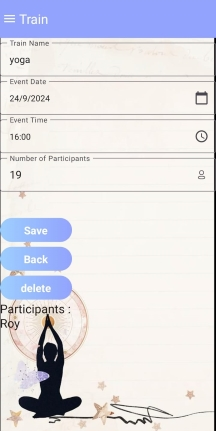

# YogaTime

YogaTime is a mobile application designed to connect yoga trainers and users. It allows users to view available yoga sessions, register, and interact with studio ratings and images, while trainers can create events and manage their sessions.

## Features

### Authentication
- **Login Screen**: Users can log into the app using their email and password. If the user doesn't have an account, they can navigate to the registration screen.  
  

- **Register Screen**: New users can create an account by providing their email, password, and other personal details. After registering, they can log into the app to access all features.  
 

### User Side
- **Home Screen**: View available yoga sessions, along with studio images and reviews. 
Users can browse through various yoga sessions, see ratings and feedback from other users, and register for a session directly.  
  

- **Profile**: Edit personal details, see registered sessions, and write reviews for sessions they have attended.  
 

### Trainer Side
- **Manage Sessions**: Create and manage yoga sessions and view feedback from users.  
 
- **Gallery**: Upload and delete studio images.  
  
- **Manage Sessions**: Manage yoga sessions.  
  
- **Profile**: Edit personal details, add new coach.  
 
## Tech Stack
- Kotlin
- Firebase for user data and session management.

## Contributors
- Elor Israeli
- Roy Wasker
- Roni Michaeli

---